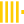
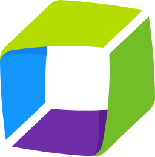
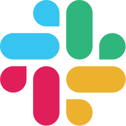
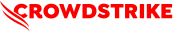

<p align="center">
  
</p>

<p align="center">
  <picture>
    <source media="(prefers-color-scheme: dark)" srcset="docs/assets/brand/veoveo.png">
    
  </picture>
</p>

<p align="center">
  <a href="https://github.com/BiomaAI/veoveo/actions/workflows/local-test-report.yml"></a>
</p>

<h3 align="center">Autonomous agents that run operations in the physical world.<br>
On infrastructure you own.</h3>

Veoveo is a self-hosted platform for AI agents that work with physical systems.
Agents read sensors and camera streams, rehearse missions in simulation, command
robots, and record everything that happened so people can query it later. The organization that deploys Veoveo runs it on its own cluster, with its
own identity provider, storage, models, policies, and domain name.

[Product tour](#product-tour) · [Agentic apps](#agentic-apps) ·
[Compared to Palantir](#compared-to-palantir) ·
[Robots and simulators](#connect-robots-and-simulators) ·
[Reference integrations](#reference-integrations) ·
[Connectors](#enterprise-connectors) ·
[Deployment](#deploy-your-installation) ·
[Software factory](#a-software-factory) ·
[Documentation](docs/README.md) ·
[Technical design](docs/TECH_DESIGN.md) ·
[Screenshot gallery](docs/screenshots/GALLERY.md)

[](docs/screenshots/gallery/console-app-view.png)

*A reference installation running the View app over live Google
Photorealistic 3D Tiles, rendered on cluster GPUs.*

## What You Can Do With It

- **Command robots.** Agents operate robots and other physical systems through
  MCP servers the installation connects, under its identity, policy, and audit.
- **Rehearse in simulation.** Connect any simulator the same way and rehearse a
  mission before it runs in the field. The
  [reference integrations](#reference-integrations) fly a PX4 drone fleet in
  Isaac Sim and control traffic in SUMO.
- **Run detection on video.** Detect and track objects in authorized camera
  streams on your own GPUs.
- **Record field operations.** Stream camera, telemetry, and robot state
  from field producers into one timeline.
- **Query recordings with Rerun.** Open any recording you can access in the
  native Rerun Viewer, or load it into pandas with Rerun's Python SDK.
- **Ask what happened.** Ask questions about synchronized recordings of world
  state, sensors, poses, and annotations. Each answer links back to the
  recordings it used, and each query is audited.
- **Forecast, optimize, and query.** Timeseries forecasts with uncertainty
  bands, GPU vehicle routing and mathematical optimization with solutions
  checked independently of the solver, and SQL over operational data.
- **Share results.** Each result is stored as an artifact with an owner,
  provenance, and release state. Releasable artifacts can be shared through
  expiring, revocable links.
- **Build agentic apps.** Ship interactive apps in which an agent does
  the work behind a live interface. Apps use the installation's sign-in,
  policy, and audit log from their first request.

## Connect Robots And Simulators

Agents work from data the installation manages: map releases and routing,
civil time and calendars, coordinate frames, photorealistic 3D Tiles scenes,
simulated worlds, and continuous recordings of fielded operations.

Robots, fleets, and simulators join an installation as MCP servers. Each one is
connected the same way, whether it is a physical system or a simulation of one:

- An MCP server in the installation's fork owns the system's control link.
  Reads and commands become tools, long operations become tasks with a declared
  recovery behavior, and watched conditions become resources agents subscribe to.
- The system publishes its state, sensors, and cameras to Recording Hub as Rerun
  streams, so a rehearsal and a fielded run produce the same kind of recording.
- Cameras publish through the live-view contract, which the Python SDK implements
  for Python servers.
- The server registers in the gateway catalog. From its first request, its tools
  pass the installation's identity, policy, task, artifact, and audit checks, and
  agents, Stream, Reason, and the Console can work with it.

A server can add the domain authority its system needs on top of the
installation's policy. The UAV reference integration, for example, lets an agent
command a vehicle only while it holds that vehicle's grant and an exclusive
command lease. [Fork development](docs/FORK_DEVELOPMENT.md) covers where the
server lives, and the [reference integrations](#reference-integrations) are
working examples.

## Recordings In Rerun

An installation records what happens in [Rerun](https://rerun.io/)'s open format:
sensor and camera streams from the field, world state from robots and simulators, poses
and telemetry, Stream detections, and Reason results. Producers push data through
the gateway from inside the cluster, a local network, or the internet, and each
recording keeps its streams on one synchronized timeline. A rehearsal in simulation
and a fielded run produce the same kind of recording, so they can be opened side by
side.

Each recording has an owner, tenant, data labels, grants, and a retention policy.
Recordings are stored as immutable Rerun 0.38.1 files and served as Rerun datasets
over the Rerun Data Protocol. People with access open them in the Console, in the
native Rerun Viewer, or in a Python notebook through Rerun's Catalog SDK. Stream
replays video from recordings, Reason answers questions grounded in them, agents
query them, and derived results are stored back as new layers of the same recording.

That makes Veoveo ready for physical AI work: one record of what robots, simulators,
and agents did, kept under the installation's access rules and readable by the tools
robotics teams already use. [Use recordings with Rerun](docs/RERUN_RECORDINGS.md)
shows how to connect.

## Identity, Policy, And Audit

Every request goes through the gateway, whether an operator types it or an
agent issues it. The gateway authenticates the caller, checks the profile's
policy, and records the decision in the audit log. Long-running work runs as
an MCP Task that survives client disconnects. Its outputs are stored as
recordings and artifacts that name who requested them. Operators see the same
tasks, artifacts, and audit records in the Console that agents act on.

Authority sits in the gateway and the servers behind it. The agent harness
holds none, so any compatible MCP host can drive an installation without
receiving server credentials. NVIDIA's
[agent-stack security guidance](https://developer.nvidia.com/blog/where-security-fits-in-an-ai-agent-stack)
puts the line in the same place: "The harness guides what an agent tries. The
infrastructure controls what an agent can do." A server can add domain authority
on top of that policy, as the UAV reference integration does with an exclusive
command lease for each vehicle.

<a href="docs/images/harness-poster.png">
  <picture>
    <source media="(prefers-color-scheme: dark)" srcset="docs/images/harness-poster-dark.png">
    
  </picture>
</a>

## Compared To Palantir

The closest commercial comparison is Palantir. The biggest difference is who
runs the software. Palantir delivers and operates its platforms inside customer
environments through Apollo. A Veoveo installation is run by the organization
that owns it, and Veoveo's release process holds no credentials to that cluster.

| Palantir product | What it does | How Veoveo compares |
|---|---|---|
| AIP | AI agents acting on enterprise systems through a controlled action layer | Closest match. Veoveo's gateway provides identity, policy, long-running tasks, and audit over the open Model Context Protocol, so any MCP host and any model can use it. |
| Gotham / Maven | Defense intelligence: sensor fusion, mission command, decision support | Same domain, different starting point. Veoveo starts from the runtime: agents rehearse missions in simulation, command robots in the field, and record every run. It has no equivalent of Gotham's intelligence-analysis tooling. |
| Foundry | Enterprise data integration, ontology, and operational applications | Partial overlap. Work Contexts, artifacts, and analytical stores cover data ownership and access, and MCP Apps provide operational interfaces. Veoveo has no equivalent of Foundry's ontology. |
| Apollo | Vendor-operated software delivery into customer environments | Veoveo publishes OCI images and Helm charts, and the installation owner reconciles them with its own GitOps controller. |

Veoveo adds control and recording of the operations themselves: robots and
simulators connected as governed MCP servers, live video pipelines, and a Rerun
timeline of each mission that authorized people and tools can replay and query. The two can run side by side. Palantir
Foundry is listed in the [connector catalog](docs/connectors/README.md).

## Agentic Apps

An agentic app pairs an agent with a live interface. An operator types an
instruction, the agent drives a robot, a simulator, or a video pipeline, and the
interface shows progress and results as they arrive. Veoveo's own charts,
maps, forecasts, and 3D views are built this way, and the server capabilities
behind them are available to your apps.

Apps sign users in through the installation's identity provider and run under
the same policy scopes, Work Context access, and audit log as any other caller.
Their long-running work continues after a browser session ends. They deploy
with the installation and run in the Console or in a compatible external MCP
host. [MCP Apps](#mcp-apps) explains how a server
ships its interface.

## Product Tour

An installation starts with the standard server catalog and can add its own
servers in its fork of this repository. Those servers go through the same gateway
as the built-in ones.

| Capability | What it provides |
|---|---|
| Real and simulated worlds | Robots and simulators connected as MCP servers, recordings, coordinate frames and time references, camera streams, and 3D Tiles scenes. SUMO and Isaac Sim are the reference integrations. |
| Analysis and planning | Sandboxed DuckDB SQL, forecasting, optimization, operator-approved live and replay video processing, and temporal reasoning. |
| Long-running work | Tasks that recover after restarts, cancellation, budgets, agent wakes, and stored results for work that outlives one request. |
| Interactive apps | Interfaces that ship with each server for charts, forecasts, maps, and 3D views rendered on cluster GPUs. The same app can run in the Console or a compatible external MCP host. |
| Ownership and sharing | Work Context ownership, a record of who requested each output, immutable artifact identities, policy decisions, grants, release state, and revocable sharing. |
| Open protocol | Policy-scoped profiles over MCP tools, resources and templates, prompts, completions, tasks, subscriptions, notifications, structured content, and URI identities. |
| Enterprise operation | OIDC/OAuth identity, Kubernetes scheduling and scaling, Helm packages, OCI delivery, GitOps reconciliation, audit export, and an offline installation path. |

### Workspace and Console

Workspace, at `/workspace/`, is the everyday chat client. A chat's owner invites
people and agents into the conversation, and each agent's response streams
separately. Each person's private Activity panel shows their tool results, Task
progress, input requests, and cancellation controls. Workspace also opens
Computers and files under the same permissions. See the
[Workspace design](apps/workspace/DESIGN.md).

Console, at `/console/`, is the administration client for the installation's
apps, services, agents, and access. Both clients are served by the same Rust
backend, and neither passes gateway credentials to browser JavaScript.

### Operations in the Console

The Console shows the same task, policy, artifact, recording, MCP, and
Kubernetes state that agents reach through the gateway.

| | |
|---|---|
| [](docs/screenshots/gallery/console-overview.png) | [](docs/screenshots/gallery/console-work.png) |
| Installation health and recent activity | Long-running work across Reason, Stream, and simulation |
| [](docs/screenshots/gallery/console-access.png) | [](docs/screenshots/gallery/console-audit.png) |
| Membership, authority, and access requests | Policy decisions with trace context |
| [](docs/screenshots/gallery/console-cluster.png) | <a href="docs/images/operations-loop.png"><picture><source media="(prefers-color-scheme: dark)" srcset="docs/images/operations-loop-dark.png"></picture></a> |
| Workloads, placement, storage, readiness, and image identity | Reactive and proactive loops that run nonstop |

### Recordings and artifacts

Rerun recordings keep world, sensor, pose, and annotation data synchronized.
Recordings are stored in segments, but the Console plays each one as a single
continuous timeline. Outputs derived from a recording are stored as artifacts
with an owner, provenance, release state, and access list.

| | |
|---|---|
| [](docs/screenshots/gallery/console-artifacts.png) | [](docs/screenshots/gallery/console-artifact-reason.png) |
| Immutable outputs and release state | Reasoning result with recording provenance |
| [](docs/screenshots/gallery/console-artifact-video.png) | [](docs/screenshots/gallery/console-recordings.png) |
| Stream-derived media preview and access | One authorized timeline in embedded Rerun |

## Reference Integrations

Two reference integrations show how a system connects to the platform, end to
end. Each one is a deployable workload with typed MCP contracts, a recording path,
and acceptance tests. Robots and simulators you connect follow the same pattern,
described in [Connect robots and simulators](#connect-robots-and-simulators).

### UAV flight in Isaac Sim

An operator sends one plain-language message to a pilot agent:

> Fly uav-1 to Times Square now. Read your active UAV control grant, ask Map MCP to
> resolve and route this named location from current telemetry, then use UAV MCP to admit
> and execute the mission only for your bound vehicle. Report the terminal result.

<p align="center">
  <a href="showcase/uav-sim/assets/uav-e2e-001-flight-timelapse.mp4">
    
  </a>
</p>

*The actual leader-camera recording, sped up 30×. The full
[26-second H.264 replay](showcase/uav-sim/assets/uav-e2e-001-flight-timelapse.mp4)
comes from the Recording Hub archive.*

The first accepted run covered 9.227 km in 13 minutes 10 seconds. It completed all four
admitted waypoints, arrived at 40.7580° N, 73.9855° W with zero collisions, and released
its command lease.

| Component | What happened |
|---|---|
| Addressed agent | `uav-1-pilot` accepted the operator message and ran one durable episode. |
| Map MCP | Resolved Times Square and returned the admitted route from current telemetry. |
| UAV Simulation MCP | Enforced the pilot-to-`uav-1` grant and protected execution with one command lease. |
| Recording Hub | Archived the leader camera, pose, telemetry, and mission lifecycle across the complete execution interval. |

The prompt contained no coordinates and granted no vehicle authority. The agent
resolved the destination through Map and flew under its existing grant for
`uav-1`. The Console and a headless client reported the same final result.
[Inspect the Console evidence](showcase/uav-sim/assets/uav-e2e-001-console-complete.png)
or repeat the
[`UAV-E2E-001` acceptance](showcase/uav-sim/ACCEPTANCE.md#uav-e2e-001-per-agent-named-location-mission-e2e).
The flight is also a Rerun dataset that can be
[queried from Python](docs/RERUN_RECORDINGS.md).

| San Salvador | Midtown Manhattan |
|---|---|
| [](docs/screenshots/gallery/isaac-uav-san-salvador.png) | [](docs/screenshots/gallery/isaac-uav-new-york.png) |
| A multirotor under PX4 control above the Jorge “Mágico” González stadium district | Dense New York photogrammetry around Times Square and Central Park |

Both frames come from the live headless Isaac Sim RTX viewport. The showcase
camera follows the Newton-simulated vehicle after PX4 reaches the configured flight
altitude. [Explore the complete UAV showcase](showcase/uav-sim/README.md).

| UAV recording | SUMO traffic world |
|---|---|
| [](docs/screenshots/gallery/rerun-uav.png) | [](docs/screenshots/gallery/rerun-sumo.png) |
| Camera, pose, telemetry, Stream detections, and reasoning results in one recording. Live processing never waits on the recording path. | A pinned SUMO and LuST Luxembourg world exposes traffic reads, signal and vehicle control, network generation, durable batches, live subscriptions, and Rerun recording. [Run the SUMO showcase](showcase/sumo/README.md). |

## Built On The Model Context Protocol

Agents and the Console reach every capability above through the
[Model Context Protocol](https://modelcontextprotocol.io/specification/):
tools, resources, prompts, completions, tasks, subscriptions, and
notifications. A client connects to one gateway endpoint to reach every
server, and a server registered with the gateway becomes available to every
client. Any compatible MCP host can drive an installation.

<a href="docs/images/integration-matrix.png">
  <picture>
    <source media="(prefers-color-scheme: dark)" srcset="docs/images/integration-matrix-dark.png">
    
  </picture>
</a>

*From N × M integrations to N + M contracts.*

### MCP Apps

An MCP server can return a self-contained interface along with a tool result.
The host supplies the sandbox and theme, and every action the interface takes
still goes through the gateway's authorization and audit. The Console also
includes a standalone app host, so an installation can give users one app as a
full page without the rest of the Console. The View app below was opened from a
plain-language request and rendered by Claude as an external MCP host.

<p align="center">
  <a href="docs/screenshots/gallery/mcp-app-view-claude.png">
    
  </a>
</p>

| | |
|---|---|
| [](docs/screenshots/gallery/console-app-chart.png) | [](docs/screenshots/gallery/console-app-timeseries.png) |
| Interactive charts from typed results | Forecast means and uncertainty bands |
| [](docs/screenshots/gallery/console-app-map.png) | [](docs/screenshots/gallery/console-mcp-reason.png) |
| Map sources and releases | Tools, prompts, resources, tasks, and scopes |
| [](docs/screenshots/gallery/console-mcp-map.png) | <a href="docs/images/task-sleepwake.png"><picture><source media="(prefers-color-scheme: dark)" srcset="docs/images/task-sleepwake-dark.png"></picture></a> |
| Every tool, resource, and prompt the Map server exposes | MCP Tasks: call, sleep, wake, result |

## Capability Catalog

The gateway groups hosted servers into named profiles. An operator profile can
expose the whole catalog. Narrower profiles expose fewer tools and scopes
without changing the servers behind them.

| Server | Capability |
|---|---|
| `artifact` | Artifact discovery, metadata, access grants, release state, and revocable sharing. |
| `charts` | Chart validation, compilation, static rendering, and an interactive MCP App. |
| `datasheet` | Dataset preview, column statistics, and durable profiling through the Python server template. |
| `duckdb` | Arbitrary SQL, ingestion, and immutable exports in per-owner workspaces with resource limits. |
| `frames` | WGS84, ECEF, ENU, and NED conversion with durable batch transforms. |
| `map` | Geography datasets, acquisition and releases, restrictions, routing, and map apps. |
| `media` | Provider-neutral model discovery, schemas, generation, artifact output, and webhook completion. |
| `optimization` | NVIDIA cuOpt vehicle routing, scenario batches, convex and MILP solving, with every solution re-checked independently of the solver. |
| `reason` | Semantic and temporal reasoning over recordings, with answers linked to their source recordings and audited. |
| `recording` | Recording discovery, queries, subscriptions, publication as artifacts, and viewer playback. |
| `rerun` | The bridged Rerun viewer surface. |
| `stream` | Operator-approved live and replay GStreamer pipelines, typed detection profiles, and an MCP App for encoded video with overlays. |
| `time` | Authority-bound civil time, calendars, clocks, timelines, and event operations. |
| `timeseries` | Forecasting, uncertainty output, artifacts, and an interactive forecast app. |
| `uav-sim` | Reference integration for UAV fleets: multi-vehicle simulation, missions, datasets, operator cameras rendered in the simulator, shared NVENC video, stream authorization, and a WebCodecs App. |
| `view` | 3D Tiles views rendered on cluster GPUs, camera control, and reproducible offscreen frame capture. |

The agent runtime adds episodes that survive restarts, detach and resume,
wakes, budgets, analytical memory, and Rerun recording.

Your own agentic apps and domain servers live in your fork, next to the built-in
servers, and build with the same image graph. Register each server in the gateway
control plane and apply the installation's trust and policy configuration.
[Fork development](docs/FORK_DEVELOPMENT.md) covers where code goes and how to take
upstream changes. An existing system of record joins the same way, behind an MCP
server.

<a href="docs/images/agent-loop.png">
  <picture>
    <source media="(prefers-color-scheme: dark)" srcset="docs/images/agent-loop-dark.png">
    
  </picture>
</a>

## Enterprise Connectors

Connector recipes tell a coding agent how to install a vendor's MCP server
next to the Veoveo connector, so one session can use both. The
[connector catalog](docs/connectors/README.md) lists the install command or
endpoint, auth model, and support status for each platform, checked against
vendor documentation. Servers that only speak the older MCP `2025-11-25`
revision connect through an isolated
[legacy bridge](mcp/bridges/legacy/DESIGN.md), so the installation itself stays
on the current revision.

<table align="center" aria-label="Enterprise connector logos">
  <tbody>
    <tr>
      <td align="center" width="72"><a href="https://www.databricks.com/"></a></td>
      <td align="center" width="72"><a href="https://www.snowflake.com/"></a></td>
      <td align="center" width="72"><a href="https://clickhouse.com/"></a></td>
      <td align="center" width="72"><a href="https://motherduck.com/"></a></td>
      <td align="center" width="72"><a href="https://grafana.com/"></a></td>
      <td align="center" width="72"><a href="https://www.datadoghq.com/"></a></td>
    </tr>
  </tbody>
</table>
<table align="center" aria-label="Enterprise connector logos">
  <tbody>
    <tr>
      <td align="center" width="72"><a href="https://www.dynatrace.com/"></a></td>
      <td align="center" width="72"><a href="https://www.splunk.com/"><picture><source media="(prefers-color-scheme: dark)" srcset="docs/assets/connectors/splunk-dark.svg"></picture></a></td>
      <td align="center" width="72"><a href="https://www.mapbox.com/"><picture><source media="(prefers-color-scheme: dark)" srcset="docs/assets/connectors/mapbox-dark.svg"></picture></a></td>
      <td align="center" width="72"><a href="https://www.tomtom.com/"></a></td>
      <td align="center" width="72"><a href="https://carto.com/"></a></td>
      <td align="center" width="72"><a href="https://www.openstreetmap.org/"></a></td>
    </tr>
  </tbody>
</table>
<table align="center" aria-label="Enterprise connector logos">
  <tbody>
    <tr>
      <td align="center" width="72"><a href="https://www.planet.com/"></a></td>
      <td align="center" width="72"><a href="https://www.earthdata.nasa.gov/"></a></td>
      <td align="center" width="72"><a href="https://www.palantir.com/"><picture><source media="(prefers-color-scheme: dark)" srcset="docs/assets/connectors/palantir-dark.svg"></picture></a></td>
      <td align="center" width="72"><a href="https://www.ros.org/"><picture><source media="(prefers-color-scheme: dark)" srcset="docs/assets/connectors/ros-dark.svg"></picture></a></td>
      <td align="center" width="72"><a href="https://www.autodesk.com/"><picture><source media="(prefers-color-scheme: dark)" srcset="docs/assets/connectors/autodesk-dark.svg"></picture></a></td>
      <td align="center" width="72"><a href="https://www.pagerduty.com/"></a></td>
    </tr>
  </tbody>
</table>
<table align="center" aria-label="Enterprise connector logos">
  <tbody>
    <tr>
      <td align="center" width="72"><a href="https://slack.com/"></a></td>
      <td align="center" width="72"><a href="https://www.atlassian.com/"></a></td>
      <td align="center" width="72"><a href="https://linear.app/"></a></td>
      <td align="center" width="72"><a href="https://github.com/"><picture><source media="(prefers-color-scheme: dark)" srcset="docs/assets/connectors/github-dark.svg"></picture></a></td>
      <td align="center" width="144"><a href="https://www.crowdstrike.com/"></a></td>
    </tr>
  </tbody>
</table>

*The catalog spans geospatial, Earth observation, weather, data, observability,
industrial operations, defense, and incident platforms. All logos belong to
their respective owners.*

## Architecture

<a href="docs/images/system-map.png">
  <picture>
    <source media="(prefers-color-scheme: dark)" srcset="docs/images/system-map-dark.png">
    
  </picture>
</a>

SurrealDB is the required coordination store. It holds identity, policy,
task, artifact, recording, agent, audit, and outbox records. S3-compatible
object storage holds artifact bytes, and Rerun RRD segments hold recording
history. DuckDB runs separately as the analytical SQL engine.

Architecture decisions and call paths are documented in
[`docs/ARCHITECTURE_DECISIONS.md`](docs/ARCHITECTURE_DECISIONS.md) and
[`docs/TECH_DESIGN.md`](docs/TECH_DESIGN.md).

## Governance Model

Every task, recording, agent, and artifact belongs to a Work Context. Before
work starts, the gateway determines who is acting: a person, an agent acting on
someone's behalf, or an automated trigger. Services store that identity with
each output and apply the Work Context's rules for ownership, initial grants,
classification, and labels.

Human users authenticate through enterprise OIDC. MCP clients use OAuth grants
bound to the protected resource, and the gateway signs short-lived service
identity assertions for hosted servers. Browser code never receives the
Console's bearer token.

Artifacts use opaque `artifact://{uuidv7}` occurrence identities. Authorized
users can receive explicit grants. A releasable artifact may also receive an
expiring, revocable read-only link with an optional download limit. Content
hashes are used for integrity checks and deduplication within a tenant. Only
grants and share links give access.

The full model, with guidance on mapping it to an enterprise's own roles, is in
[`docs/WORK_CONTEXT_GOVERNANCE.md`](docs/WORK_CONTEXT_GOVERNANCE.md).

## Deploy Your Installation

The same Helm charts install Veoveo on a laptop k3d cluster, a datacenter GPU
cluster, or an air-gapped site. Kubernetes places simulators and other GPU
workloads on GPU nodes and scales the stateless servers. Field producers upload
recordings through the gateway from inside the cluster, from a local network,
or over the internet. Each installation keeps its Helm values, gateway
configuration, and Secret references in its own repository, so no customer
state lives in this one.

<a href="docs/images/deployment-map.png">
  <picture>
    <source media="(prefers-color-scheme: dark)" srcset="docs/images/deployment-map-dark.png">
    
  </picture>
</a>

| Path | Use it for | Guide |
|---|---|---|
| Local k3d | A real local Kubernetes cluster with registry-first image delivery and mandatory NVIDIA validation. | [`deploy/local/k3d`](deploy/local/k3d/README.md) |
| Direct Helm | A connected cluster managed by an existing platform team. | [`deploy/helm/veoveo`](deploy/helm/veoveo/README.md) |
| Enterprise GitOps | Immutable OCI charts and image digests reconciled by the installation owner's Flux or equivalent controller. | [`docs/ENTERPRISE_DEPLOYMENT.md`](docs/ENTERPRISE_DEPLOYMENT.md) |
| Offline | A verified bundle containing runtime images, charts, schemas, checksums, image identities, and SPDX SBOMs. | [`deploy/offline`](deploy/offline/README.md) |

The [Autonomy Harness](docs/AUTONOMY_HARNESS.md) document divides
responsibility between Veoveo and the installation owner for keeping always-on
agents within limits on identity, data, network, compute, spend, and side
effects.

[`examples/bioma`](examples/bioma/README.md) is a working enterprise
installation to follow. Replace its hostname and infrastructure choices with
your own.

### GPU execution contract

Optimization, simulation, perception, reasoning, 3D rendering, Rerun, and
visual acceptance tests require a hardware GPU. Their Kubernetes workloads
request an NVIDIA device and stop with an error when cuOpt, CUDA, Vulkan,
WebGPU, or WebGL cannot reach the hardware. There is no CPU solver or
software-rendering fallback.

The local k3d cluster schedules GPUs through the same `nvidia.com/gpu` resource
as production installations. Before a browser test touches a visual surface, it
probes WebGPU and WebGL and stops unless at least one is hardware-backed.

## Roadmap

Next on the roadmap: digital twins of an installation's own sites and fleets,
built from the map data, recordings, and telemetry it already stores. Simulation
and forecasting would then start from the real site rather than a generic
scene.

## Standards And Protocols

The table lists the published standards Veoveo implements at its external
interfaces, plus its own repository-owned extensions. Where a standard has
optional features, Veoveo implements only the subset its designs describe.

| Area | Implemented standards and protocols |
|---|---|
| Agent and app interfaces | Model Context Protocol `2026-07-28` over JSON-RPC 2.0 and stateless Streamable HTTP; official MCP Tasks; JSON Schema 2020-12; and [MCP Apps](mcp/apps-extension/DESIGN.md). |
| Identity and authorization | OpenID Connect Core; OAuth 2.0 Authorization Code with S256 PKCE, Client Credentials, and JWT Bearer grants; RFC 8414 metadata; RFC 9728 protected-resource metadata; RFC 8707 resource indicators; JWT, JWS, and JWK; MCP enterprise-managed authorization and ID-JAG. |
| Recordings, data, and media | Rerun 0.38.1 RRD and `VideoStream`; read-only Rerun Data Protocol over native gRPC and gRPC-Web; versioned protobuf recording ingest; S3-compatible object APIs; DuckDB SQL; Apache Parquet; and OTLP/HTTP telemetry. |
| Geography and time | WGS84/EPSG identities; GeoJSON RFC 7946; OGC JSON-FG and CQL2; GeoParquet 1.0; Mapbox Vector Tile 2.1; MapLibre Style 8; RFC 3339; RFC 9557; IANA TZDB/TZif and leap-second data; TAI and GPS time. |
| Optimization | NVIDIA cuOpt 26.08 on CUDA 13.3; `veoveo.io/travel-model-artifact/v1` for the Map handoff; and the private pod-local `veoveo.io/cuopt-executor/v1` adapter protocol. |
| 3D and vehicles | OGC 3D Tiles 1.0/1.1; glTF/GLB 2.0; Draco geometry compression; OpenUSD; Newton and Warp CUDA; and MAVLink 2 HIL. |
| Packaging and operations | Kubernetes resources, Helm charts, OCI images and charts, S3-compatible storage, and OpenTelemetry. |

The supported subsets are listed in
[`docs/TECH_DESIGN.md`](docs/TECH_DESIGN.md#standards-and-protocols). Domain
profiles live in their server designs, including
[`map-mcp`](servers/map-mcp/DESIGN.md#standards-and-protocols),
[`optimization-mcp`](servers/optimization-mcp/DESIGN.md#standards-and-protocols),
[`time-mcp`](servers/time-mcp/DESIGN.md#standards-and-protocols),
[`view-mcp`](servers/view-mcp/DESIGN.md#standards-and-protocols), and
[`uav-sim-mcp`](servers/uav-sim-mcp/DESIGN.md#standards-and-protocols).

## Tech Stack

Platform services are written in Rust. Python covers the SDK, the server
template, and simulator adapters, and the Console and Workspace use TypeScript
and React. Hosted MCP servers can be written in any language that speaks the
protocol. Kubernetes and Helm run the installation, SurrealDB handles
coordination, DuckDB handles analytics, and Rerun stores recordings and serves them
to Rerun's own Viewer and SDK. NVIDIA
runtimes power cuOpt optimization, Isaac Sim, and Stream perception.

<table align="center" aria-label="Technology stack logos">
  <tbody>
    <tr>
      <td align="center" width="72"><a href="https://www.rust-lang.org/"></a></td>
      <td align="center" width="72"><a href="https://www.python.org/"></a></td>
      <td align="center" width="72"><a href="https://www.typescriptlang.org/"></a></td>
      <td align="center" width="72"><a href="https://react.dev/"></a></td>
      <td align="center" width="72"><a href="https://kubernetes.io/"></a></td>
      <td align="center" width="72"><a href="https://helm.sh/"></a></td>
    </tr>
  </tbody>
</table>
<table align="center" aria-label="Technology stack logos">
  <tbody>
    <tr>
      <td align="center" width="72"><a href="https://www.docker.com/"></a></td>
      <td align="center" width="72"><a href="https://opentelemetry.io/"></a></td>
      <td align="center" width="72"><a href="https://surrealdb.com/"></a></td>
      <td align="center" width="72"><a href="https://duckdb.org/"></a></td>
      <td align="center" width="72"><a href="https://rerun.io/"></a></td>
      <td align="center" width="72"><a href="https://developer.nvidia.com/isaac/sim"></a></td>
    </tr>
  </tbody>
</table>
<table align="center" aria-label="Technology stack logos">
  <tbody>
    <tr>
      <td align="center" width="72"><a href="https://px4.io/"></a></td>
      <td align="center" width="72"><a href="https://eclipse.dev/sumo/"></a></td>
      <td align="center" width="72"><a href="https://cesium.com/"></a></td>
      <td align="center" width="72"><a href="https://maplibre.org/"></a></td>
    </tr>
  </tbody>
</table>

*All logos belong to their respective projects.*

## A Software Factory

The repository is organized as a software factory in which coding agents
extend, deploy, and operate Veoveo. Veoveo does not ship its own coding harness.
Teams use the agent they already have, whether that is a terminal session or a
full MCP host. [`AGENTS.md`](AGENTS.md) files at the root and beside each hosted
server hold engineering conventions. The [`code map`](docs/CODEMAP.md) routes a
change to the code that owns it, and each server has a design document that
follows the [server contract](mcp/contract/DESIGN.md).

Toolchains are pinned, and contract validation rejects invalid configuration
before it reaches a cluster. Smoke tests check each deployment. Agents that
operate an installation face the same controls as human operators:
authentication, policy scopes, budgets, and audit.

In a typical engagement, a forward-deployed engineer sets up an installation
in the customer's environment. Working with coding agents, the engineer encodes
the customer's domain into policies, profiles, and servers in the installation's
fork. When the
engagement ends, the customer keeps the factory itself and runs all of it,
including the cluster, identity, models, policies, and release process.

## Develop And Verify

The service workspace, Python packages, container images, Helm charts, protocol
conformance clients, and smoke harnesses are all pinned in the repository.
Docker is required for SurrealDB-backed tests and deployment work. Native Map
builds also need a C/C++ toolchain, CMake, pkg-config, SQLite development files,
and PROJ's build dependencies.

Pick the checks for the component you changed using the
[iteration runbook](docs/DEVELOPMENT_ITERATION.md). The commands below are
examples, not a required sequence. Before committing changes to build inputs,
record the relevant checks with `cargo xtask test-report run`.

```bash
cargo fmt --all
cargo xtask enforce rust
cargo test --workspace
cargo xtask enforce python
cargo xtask smoke helm-config
cargo xtask smoke sumo-push
cargo test -p veoveo-uav-sim-mcp --all-targets
PYTHONPATH=showcase/uav-sim/runtime:sdk/python/src \
  uv run --with numpy==2.3.1 --with aiohttp==3.14.1 \
  --with pymavlink==2.4.49 --with fastcrc==0.3.6 --python 3.13 \
  python -m unittest discover -s showcase/uav-sim/runtime/tests -v
```

The smoke harness is Rust code, reviewed and tested like the rest of the
platform. `cargo xtask smoke` builds the harness and the local binaries a
scenario needs, then runs the scenario. Local deployment profiles use the tool
versions pinned in
[`deploy/local/k3d/versions.env`](deploy/local/k3d/versions.env).

For now, checks run on a single development host, and their results are
committed so GitHub can display them:

```bash
cargo xtask test-report run --name rust-workspace -- cargo xtask enforce rust
cargo xtask test-report show
```

The status is informational and does not block pushes or deployments. The
current workflow and the planned GPU CI setup are described in
[`docs/CONTINUOUS_INTEGRATION.md`](docs/CONTINUOUS_INTEGRATION.md).

## Repository Guide

| Path | Responsibility |
|---|---|
| [`agents/`](agents/) | Kernel and durable runtime for autonomous agents. |
| [`apps/console/`](apps/console/) | Console BFF and React operations interface. |
| [`apps/workspace/`](apps/workspace/) | Shared-chat productivity client with human and agent participants, private Activity and MCP Apps. |
| [`mcp/`](mcp/) | Shared MCP contracts, task and app extensions, and bridges. |
| [`platform/`](platform/) | Gateway, persistence, task, artifact, recording, and query runtimes. |
| [`servers/`](servers/) | Hosted MCP servers and their domain designs. |
| [`sdk/`](sdk/) | Python SDK shared by showcase runtimes and external clients. |
| [`templates/`](templates/) | Python MCP server template behind the datasheet server. |
| [`showcase/uav-sim/`](showcase/uav-sim/) | Isaac, Cesium, Newton, CUDA Warp, and PX4 UAV workload. |
| [`showcase/sumo/`](showcase/sumo/) | SUMO, LuST, TraCI, and the traffic world MCP server. |
| [`deploy/`](deploy/) | Helm, local k3d, and offline installation material. |
| [`examples/bioma/`](examples/bioma/) | Enterprise GitOps reference installation. |
| [`testing/`](testing/) | Protocol conformance and multi-process smoke harnesses. |
| [`tools/xtask/`](tools/xtask/) | Typed repository commands: doctor, enforce, image, release, smoke, test-report. |
| [`tools/screenshots/`](tools/screenshots/) | Repeatable authenticated Console, MCP App, and Rerun captures. |
| [`docs/`](docs/) | Architecture, governance, deployment, recording, and harness documentation. |

Start with the [documentation guide](docs/README.md) for tasks and delivery status,
the [`code map`](docs/CODEMAP.md) for ownership and call paths, the
[`reference architecture`](docs/architecture/README.md) for system views, or
the [`complete screenshot gallery`](docs/screenshots/GALLERY.md) for the visual
catalog and reproduction guide.
